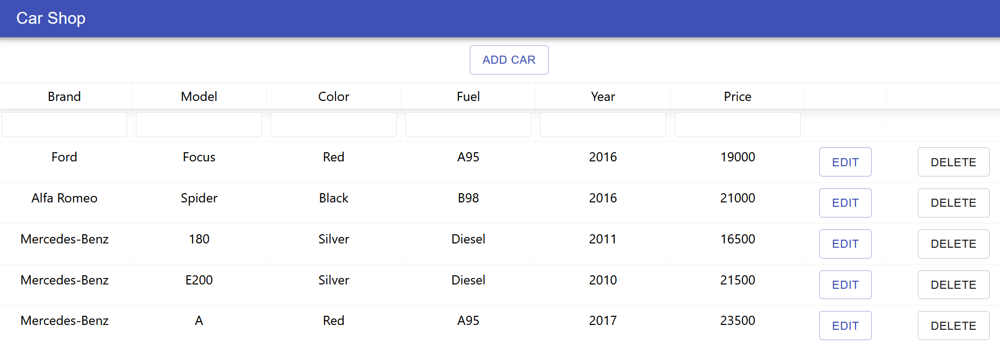

# Carshop

An example of a simple UI made with React. The UI is made with [ReactTable v6](https://github.com/tannerlinsley/react-table/tree/v6) and Material-UI [AppBar](https://material-ui.com/components/app-bar/) and [Dialog](https://material-ui.com/components/dialogs/) components.

With this implementation, you can view, filter, sort, add, edit and delete cars.
The UI is connected to backend at https://carstockrest.herokuapp.com/cars

Components: 
- [App](/src/App.js) -- Root component that contains AppBar as a title and the main Carlist component
- [Carlist](/src/components/Carlist.js) -- Main component that shows 10 cars as a default. Enables sorting, filtering, adding, editing and deleting a car
- [Addcar](/src/components/Addcar.js) -- Dialog for adding a new car
- [Editcar](/src/components/Editcar.js) -- Dialog for editing a car

## User interface

